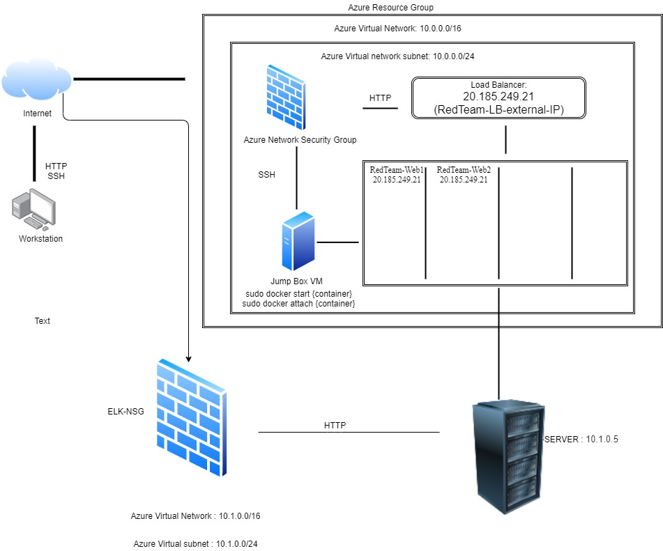
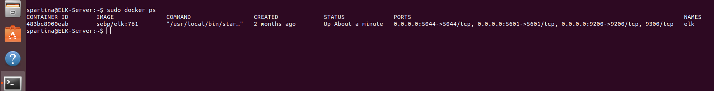

## Automated ELK Stack Deployment

The files in this repository were used to configure the network depicted below.

`VNet.jpg.jpg` 

These files have been tested and used to generate a live ELK deployment on Azure. They can be used to either recreate the entire deployment pictured above. Alternatively, select portions of the ansible directory file may be used to install only certain pieces of it, such as Filebeat.

  [ansible!](ansible)

This document contains the following details:
- Description of the Topologu
- Access Policies
- ELK Configuration
  - Beats in Use
  - Machines Being Monitored
- How to Use the Ansible Build

### Description of the Topology

The main purpose of this network is to expose a load-balanced and monitored instance of DVWA, the D*mn Vulnerable Web Application.

Load balancing ensures that the application will be highly responsive, in addition to restricting access to the network.

Integrating an ELK server allows users to easily monitor the vulnerable VMs for changes to the log file and system metrics.

The configuration details of each machine may be found below.

| Name     | Function | IP Address | Operating System |
|----------|----------|------------|------------------|
| Jump Box | Gateway  | 10.0.0.1   | Linux            |
| ELK Server | Elk Stack |  10.1.0.5  |      Linux            |
| VM 1     | DVWA     |   10.0.0.5 |  Linux                |
| VM 2     | DVWA     |  10.0.0.6  |  Linux                |

### Access Policies

The machines on the internal network are not exposed to the public Internet. 

Only the Jump Box machine can accept connections from the Internet. Access to this machine is only allowed from the following IP addresses: Private IP Address

Machines within the network can only be accessed by SSH.

A summary of the access policies in place can be found in the table below.

| Name     | Publicly Accessible | Allowed IP Addresses |
|----------|---------------------|----------------------|
| Jump Box | Yes                 | Private IP Address   |
| Elk Sever |     NO             | 10.0.0.1, 10.0.0.5, 10.0.0.6 |
| VM 1     |      NO             | 10.0.0.1  10.1.0.5           |
| VM 2     |      NO             | 10.0.0.1  10.1.0.5           |
### Elk Configuration

Ansible was used to automate configuration of the ELK machine. No configuration was performed manually, which is advantageous because it allows for scalability 
and redundancy. Scalability allows the user to deploy software to multiple servers at once while redunancy gives the user abilities to replace corrupted servers
without compromising the web applications available.

The playbook implements the following tasks:
-  The playbook would give instructions to look for the {elkserver} group and target IP addresses and installs an instance of docker.io .
-  Following the YAML file installs python3.pip.
-  Next is the installations of docker python module.
-  Expansion of memory by 262144 vm.max_map_count.
-  Finally, download and install the imagine of the ELK container:sebp/elk:761 and published_ports.

The following screenshot displays the result of running `docker ps` after successfully configuring the ELK container instance.

**Note**: The following image link needs to be updated. Replace `docker_ps_output.png` with the name of your screenshot image file.  

### Target Machines & Beats
This ELK server is configured to monitor the following machines:
10.0.0.5  10.0.0.6  
We have installed the following Beats on these machines: Filebeat and Metricbeat

These Beats allow us to collect the following information from each machine: Metricbeat helps with machine performance helps to alert the CPU stress to work more efficently. (stress test) Filebeat allows you to see changes within the log file, works with prospectors and 
### Using the Playbook
In order to use the playbook, you will need to have an Ansible control node already configured. Assuming you have such a control node provisioned: 

SSH into the control node and follow the steps below:
- Copy the ELK yml file to ansible container.
- Update the host file to include the Virtal Machines IP address
- Run the playbook, and navigate to http://[your.VM.IP]:5601/app/kibana to check that the installation worked as expected.

_As a **Bonus**, provide the specific commands the user will need to run to download the playbook, update the files, etc._
curl https://raw.githubusercontent.com/JessiPolanco/Scripts/main/ansible/ELK/elk-playbook.yml

[webservers]
_ 10.0.0.4 ansible_python_interpreter=/usr/bin/python3
_ 10.0.0.5 ansible_python_interpreter=/usr/bin/python3
_ 10.0.0.6 ansible_python_interpreter=/usr/bin/python3

_ List the IP address of your ELK server
_ There should only be one IP address
_ [elkservers]
_ 10.1.0.4 ansible_python_interpreter=/usr/bin/python3
